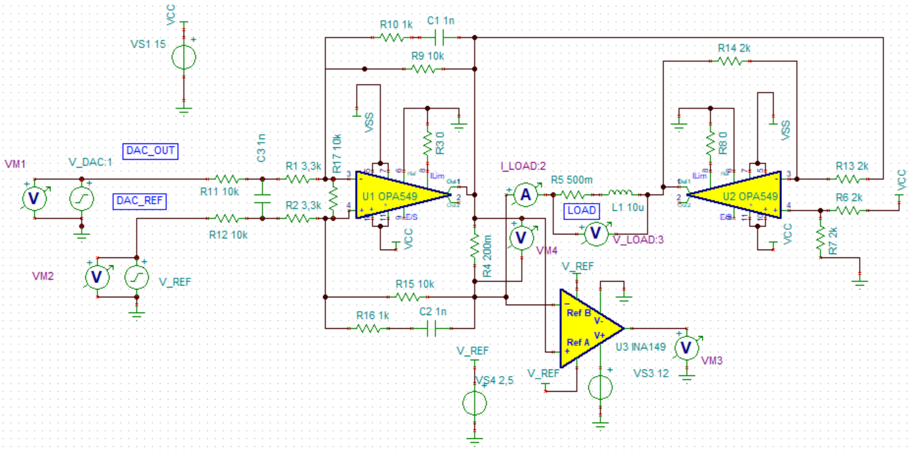
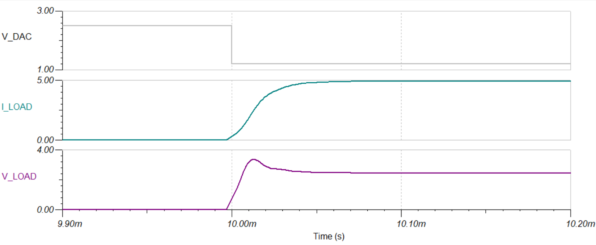

Adapting the resistor and capacitor values
==========================================
The push power op amp is connected in the following fashion:

.. image:: ../images/power_stage.png
 
Capacitor values C44 and C43 need to be adjusted to the inductance of the gradient coils used. 
For the test setup we used a load with 10 uH inductance and 500 milliohms resistance. 
The SPICE simulation indicated that a capacitor value of 1 nF is stable with enough margin. 
The simulated rise-time was about 35 us. 

The Resistors R41 and R44 can be changed to adapt the current range of the GPA. 

Assuming 3.3 kOhms for R41 and R44, the theoretical DAC voltage [V] to current [A] ratio is :math:`\frac{-10}{13.3} * 5`. 
The factor :math:`\frac{-10}{13.3}` comes from the resistors at the OP amp, the factor 5 from the 200 mOhms shunt 
resistor. There is also a 2.5 V offset voltage on the OP amp input. 
So the total formula is:

.. math:: current = (V_{in} - 2.5 V)*3.75 \frac{A}{V}. 

If we assume that the DAC can drive the voltage 
from 0 V to 5 V, the current range would be -9.375 A to +9.375 A. Since DAC linearity decreases as the output 
approaches VDD and GND, it is recommended to only use a voltage range from 0.1 V to 4.9 V.
Because of component tolerances, these values are never exact. The next paragraph shows how to use calibration 
to compensate these inaccuracies. 

.. note::
    For the following tests, 10 kOhms was used for R41 and R44, which results in a maximum current of 6.25 A.

