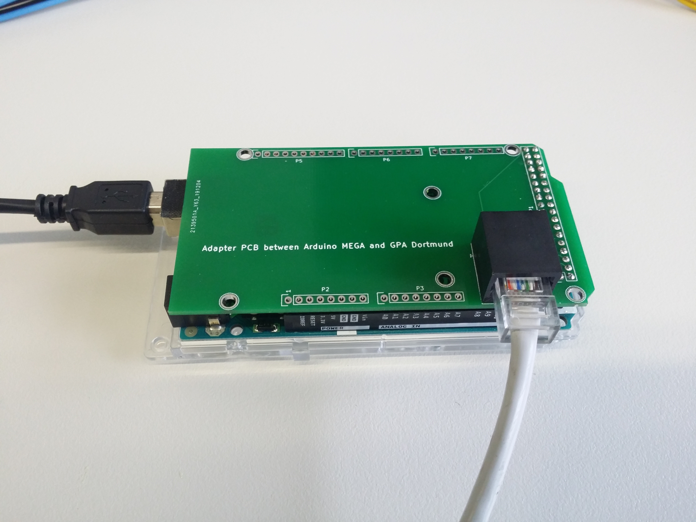

Connections
===========

--------------------------------------
Connecting the PCB to the power supply
--------------------------------------
There are onboard voltage regulators for +12V and +5V. The only devices that use the input supply voltage (VCC) directly are the OPA549 
power op amps. They have single supply maximum rating of 60V. For most applications a VCC of 15V is enough. However, if faster rise times 
are necessary or if the coils have a very high resistance, higher voltages might be necessary. It should be noted that a higher supply 
voltage causes higher heat losses in the power OP amps.

--------------------------------------------------------
Connecting the PCB to the via SPI to the microcontroller
--------------------------------------------------------
The GPA has a galvanically isolated SPI interface using the ISO7641 from Analog Devices to prevent any ground loops. The ISO7641 has 
separate power pins for both sides and can operate from 2.7V, 3.3V and 5V logic levels. The maximum supply voltage is 6V. The maximum SPI 
speed is 150Mbps, however the DAC80504 supports a maximum SPI clock of 50MHz and the ADS8684 supports a maximum SPI clock of 16MHz.
The connector for the SPI is a standard RJ45 connector. 

The pinout is:

+----------+--------------+----------+
| Pin      | Color        | Function |
+==========+==============+==========+
| 1        | white/orange | GND      |
+----------+--------------+----------+
| 2        | orange       | VDD      |
+----------+--------------+----------+
| 3        | white/green  | GND      |
+----------+--------------+----------+
| 4        | blue         | MCLK     |
+----------+--------------+----------+
| 5        | white/blue   | GND      |
+----------+--------------+----------+
| 6        | green        | MO       |
+----------+--------------+----------+
| 7        | white/brown  | _MSS     |
+----------+--------------+----------+
| 8        | brown        | MI       |
+----------+--------------+----------+

The abbreviations are: MI (master in), MO (master out), MCLK (master clock), _MSS (chip select).
_MSS low activates the DAC, _MSS high activates the ADC.

We have designed an Arduino shield to allow connecting the Arduino to the GPA via a standard network cable.

---------------------------------------------------------
Connecting the PCB to the gradient coils (or dummy loads)
---------------------------------------------------------
The coils or dummy loads should be connected to the GPA with at least AWG 16 wire.
