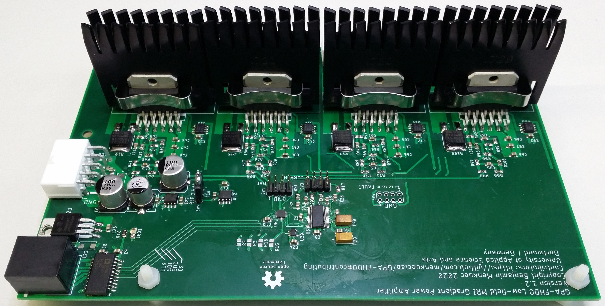

General Overview
================

This Gradient Power Amplifier (GPA) has 4 channels, of which each can drive a current of :math:`\pm 10A`.
The current is controlled via an SPI interface. The GPA has a build in current sensor for each channel 
that is also controlled via SPI. The information from the current sensor can be used for automatic calibration 
of the GPA. The GPA can easily be connected to a red pitaya that runs the 
`OCRA <https://openmri.github.io/ocra/>`_

MRI software. The version of OCRA that is compatible with this GPA 
can be found `here <https://github.com/vnegnev/marcos_extras/wiki>`_.

The power output stage of this design is based on a `GPA <https://tabletop.martinos.org/index.php/Hardware:GPA>`_ 
designed by Jason Stockmann and Nicolas Arango. 

