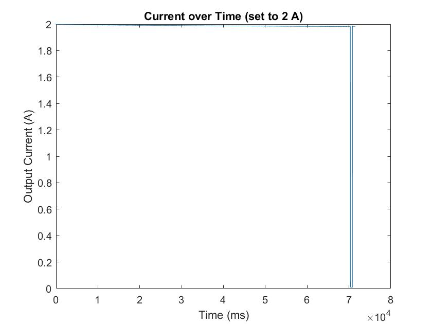
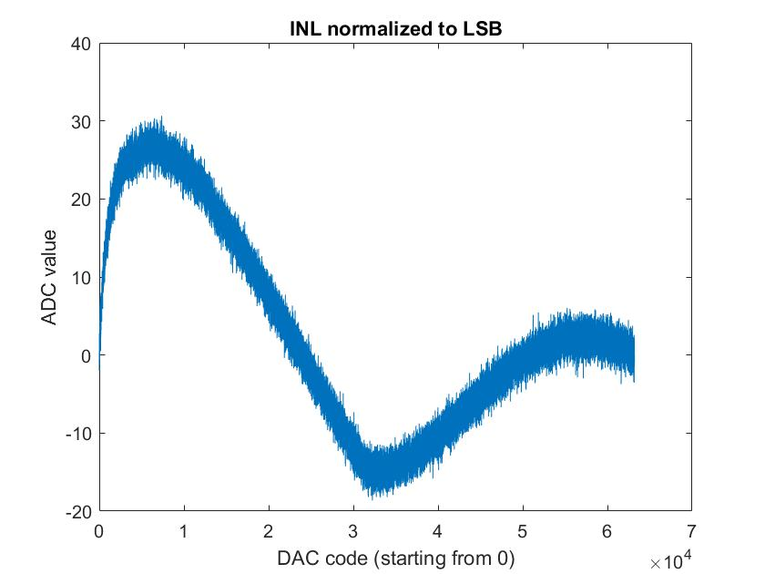
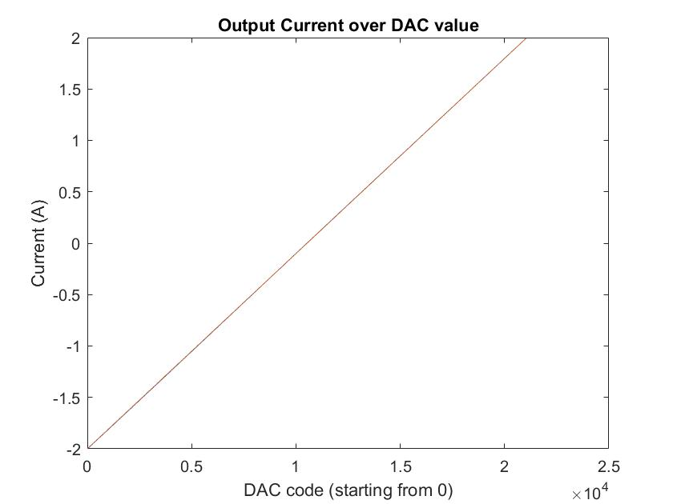
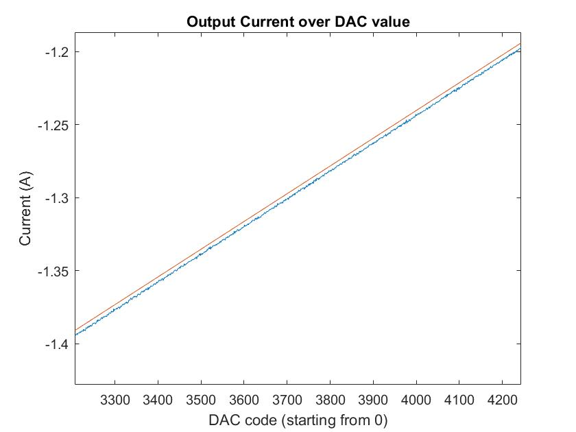

Measured Performance
====================

+--------------------------+--------------------------------------------------+
| Parameter                | Value                                            |         
+==========================+==================================================+
| Rise-Time                | 32 microseconds                                  |
+--------------------------+--------------------------------------------------+
| Linearity (+-2A)         | INL 12 LSB which equals about 4.5 mA (= 0.075%)  |
+--------------------------+--------------------------------------------------+
| Linearity (+-6A)         | INL 30 LSB which equals about 11.5 mA (= 0.192%) |
+--------------------------+--------------------------------------------------+
| Ripple                   | none                                             |
+--------------------------+--------------------------------------------------+
| Temperature offset error | max. 1 %                                         |
+--------------------------+--------------------------------------------------+

----------------------
Measurement Conditions
----------------------
Coils used were the top and bottom x-gradients of the tabletop MRI plus their corresponding shields. 
The coils can be found here. 
The total inductance of this coils were 10 uH, the resistance was 50 milliohms. 
The supply voltage was 15 V, the power supply used was a Rohde and Schwarz HMP4040. 
A current step from 0 to 2 A was applied via an appropriate SPI command to the DAC. 
The Rise-Time and Ripple was measured across the shunt-resistor on the PCB. 

The test configuration used 1 nF capacitors (C43 and C44), which is very conservative for the 10 uH load 
and results in a big stability marging. Faster rise times are with 0.1 nF capacitors easily possible. Since 
30 us rise times are fast enough for most applications, 1 nF was chosen as standard configuration. 

------------------------------
Temperature Stability Analysis
------------------------------
Temperature stability analysis was performed by setting the output current to 2 A and then recording the 
measured current until the power OP amp goes into overtemperature shutdown. According to the OPA 549 datasheet, 
the shutdown happens when a junction temperature of 160 °C is reached and end when a temperature of 140 °C is 
reached. With only small heatsinks installed and starting from room temperature, it took about 7 seconds until 
overtemp shutdown happened. The analysis and image generation was done using 
`this <https://github.com/menkueclab/GPA-FHDO/blob/master/analyze_temperature_stability.m>`_ Matlab script. 
The input file for this Matlab script is the log of the terminal output. All other lines than the ones from the 
'read' command need to be deleted manually. The log file should look like this:  

.. code-block::

   0x90fb  1.9982696 
   0x90fa  1.9978774 
   0x90fd  1.9990504 
   0x90fb  1.9982696 
   0x90fb  1.9982696 
   0x90fd  1.9990504 

| 

This graph shows the recorded current values including the shutdown phase

| 

This graph shows the recorded current values without the power down phase. We can observe, that the error over a 
temperature range from 20 °C to 160 °C is about 1 %.

------------------
Linearity Analysis
------------------

Linearity was evaluated by reading current values from the ADC via SPI while applying a ramp on the DAC (see ramp 
function in the supplied Arduino sample code). The analysis and image generation was done using 
`this <https://github.com/menkueclab/GPA-FHDO/blob/master/analyze_linearity.m>`_ Matlab script. The input file for 
this Matlab script is the log of the terminal output. All other lines than the ones from the 'read' command need to 
be deleted manually. The log file should look like this:

.. code-block::

    0xa7ea  0.0000000 0x90d6  1.9838154
    0xa7eb  0.0000000 0x90d8  1.9845963
    0xa7ec  0.0000000 0x90da  1.9853783
    0xa7ed  0.0000000 0x90da  1.9853783
    0xa7ee  0.0000000 0x90db  1.9857693
    0xa7ef  0.0000000 0x90da  1.9853783
    0xa7f0  0.0000000 0x90db  1.9857693
    0xa7f1  0.0000000 0x90db  1.9857693
    0xa7f2  0.0000000 0x90de  1.9869399

INL was calculated from the current of DAC value plots by drawing a straight line from the minimum current to the maximum current point and then taking the difference between the straigt line and measured data.

.. image:: ../images/line_zoom_6A.jpg

Calibration was performed over 33 points using first order lagrangian polynomials (linear interpolation). Using second order lagrangian polynomials would probably further improve linearity.
